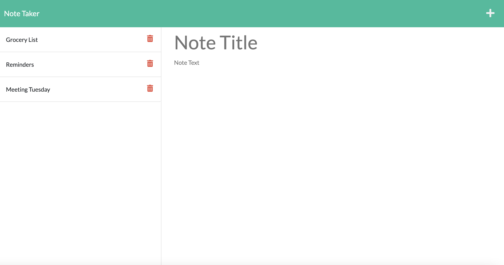

# Note - Taker

## Description

The Note - Taker application allows the user to create a note with a title and text body - save the note for later, view past notes, and delete notes that are no longer needed.

## Installation

The installation of this application is invoked through Node.js by using the following commands:

```bash
npm install
node server.js
```

## Usage

The user interacts with the application by pressing the "Get Started" button on the landing page. This brings the user to "notes" page which houses all the notes they have created, or where to write a new one. The user types in the fields marked "Note Title" and "Note Text" to create the next note.

## License

This project is licensed under the terms of the MIT license.

## Functionality



## Questions

Questions about the project? Connect with me!

- Find me on: [Github](https://github.com/evanarbour)
- Send me an e-mail: evan.arbour@gmail.com

Looking forward to hearing from you!
